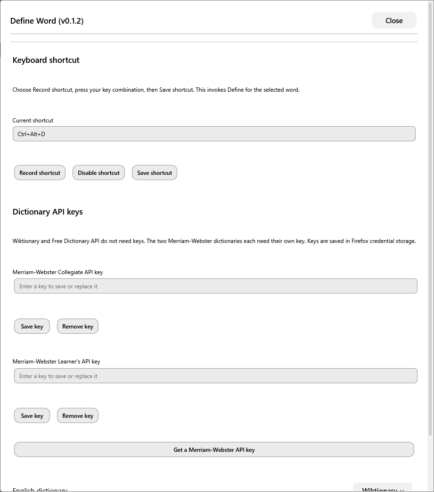

# Define Word

Look up selected English and Hebrew words without leaving the page. Select a word, then right-click **Define** or press **Ctrl+Alt+D**. The popup shows definitions, examples when available, and a link to the dictionary entry. Hebrew results use right-to-left text.

## Install

With [Sine](https://github.com/CosmoCreeper/Sine) installed, paste this URL into its GitHub installation field:

```text
https://github.com/YiftahCooper/Zen-Mods/tree/main/define-word
```

Allow JavaScript mods in Sine. To update an installation from the old standalone repository, use Sine's update check or switch its source to this folder. Existing settings and saved dictionary keys are preserved.

## Dictionaries

| Language | Dictionary | API key |
| --- | --- | --- |
| English | Wiktionary — default | Not needed |
| English | Free Dictionary API | Not needed |
| English | Merriam-Webster Collegiate | Required |
| English | Merriam-Webster Learner's | Required |
| Hebrew | ויקימילון | Not needed |

Choose a dictionary in the popup or set your defaults in **Sine → Define Word → Configure**. The mod uses your selected dictionary; it doesn't switch providers when a lookup fails.

Merriam-Webster's two dictionaries need separate keys from [dictionaryapi.com](https://dictionaryapi.com/). Enter them in the matching fields under **Configure → Dictionary API keys**, then select **Save key**. Keys are stored in Firefox's credential manager.

## Settings and use

<details>
<summary>Screenshot: settings in Sine</summary>



</details>

- **Shortcut:** choose **Record shortcut**, press your preferred combination, then **Save shortcut**. You can also disable it. Some browser or operating-system shortcuts may conflict.
- **Menu icon:** show or hide the icon beside **Define**.
- **Close:** press Escape or close the popup. Changing tabs or navigating also closes it.
- **Settings:** the popup's Settings button opens the same Sine configuration page.

Dictionary coverage varies, especially for Hebrew inflections. A missing entry is shown as such. If a pointed Hebrew word isn't found, the mod can retry without niqqud and label that result. Free Dictionary API may be unavailable; select another dictionary if it fails. Authenticated Merriam-Webster lookups have not yet been verified with a real key.

## Privacy

A Define action sends the selected word to the dictionary you chose. Requests omit cookies and the page URL. The mod adds no persistent lookup history or telemetry, and it excludes selections from password fields. Optional API keys are sent only to the relevant Merriam-Webster API. Opening the source link visits the dictionary's website normally.

Dictionary content and trademarks belong to their respective owners. [Merriam-Webster logo attribution](assets/README.md). [All mods](../README.md).
