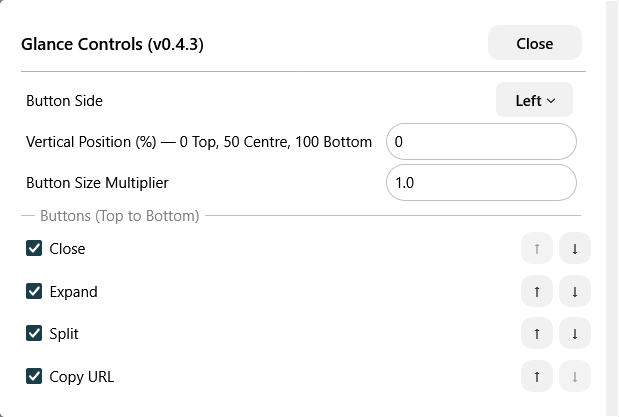

# Glance Controls

Put Zen's Glance buttons where you want them. Choose their side, height, size and order, hide buttons you don't use, and copy the open Glance page's URL with the chain-link button.

## Install

With [Sine](https://github.com/CosmoCreeper/Sine) installed, paste this URL into **Settings → Sine Mods → Install from GitHub**:

```text
https://github.com/YiftahCooper/Zen-Mods/tree/main/glance-controls
```

Allow JavaScript mods in Sine and restart Zen once after installation. Disable other mods that reposition Glance buttons, including **Left Side Glance Buttons**.

If you're updating from the old **Glance Button Position** repository or folder, switch to the URL above. Your saved settings use the same identifiers and carry over.

## Settings

<details>
<summary>Screenshot: settings in Sine</summary>



</details>

Open **Glance Controls → Configure** in Sine. Changes apply immediately after the first restart.

| Setting | How it works |
| --- | --- |
| **Button Side** | Left or right, independently of the browser sidebar. |
| **Vertical Position (%)** | Any number from 0 to 100: 0 is top, 50 is centre, 100 is bottom. Decimals work; enter `37.5`, without `%`. |
| **Button Size Multiplier** | `1` is normal, `0.7` is 30% smaller, `1.2` is 20% larger. Buttons, icons and spacing scale together. Range: 0.25–3. |
| **Buttons (Top to Bottom)** | Use ↑ / ↓ to reorder Close, Expand, Split and Copy URL. Untick a checkbox to hide its button. |

The visible buttons stay in one vertical stack centred at your chosen height, with a small margin at the top and bottom. Hidden buttons leave no gaps. Press Tab or click outside a number field to apply it.

**Copy URL** copies the page currently open in Glance, including navigation since it opened. The tooltip changes to **Copied** after success. The mod makes no network requests.

Without JavaScript, Copy URL and ordering are unavailable. The native buttons still support side, size, visibility and vertical positioning, but positioning uses the stack's available travel distance.

If settings don't take effect after installation, restart Zen. Very large buttons may not fit a small Glance panel; reduce their size or hide some buttons.

Inspired by [psu's Left Side Glance Buttons](https://github.com/psu/zen-mods). [MIT license](LICENSE). [All mods](../README.md).
